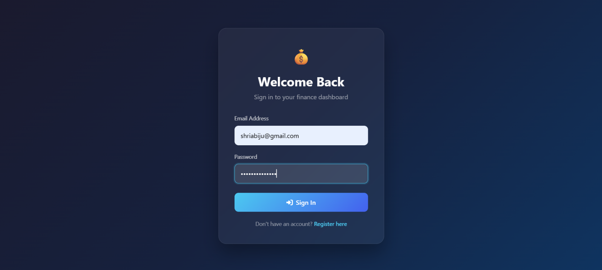
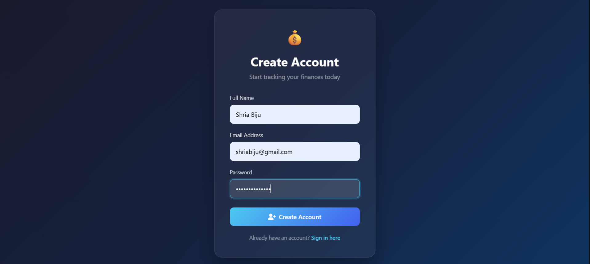
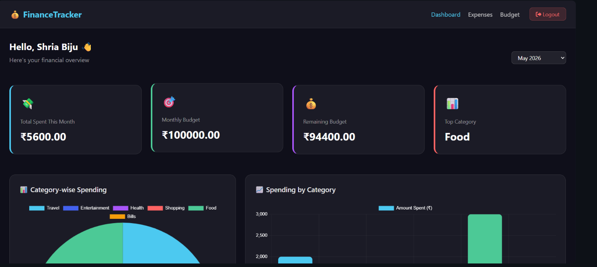
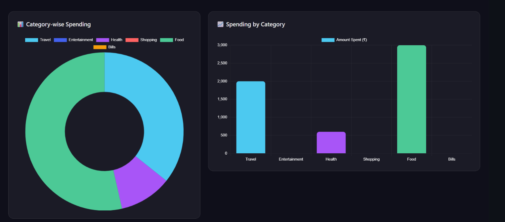
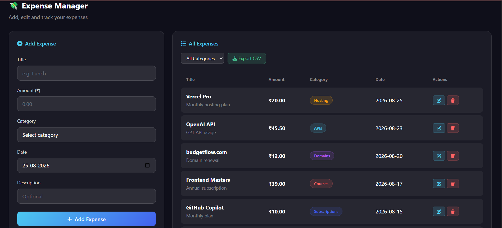
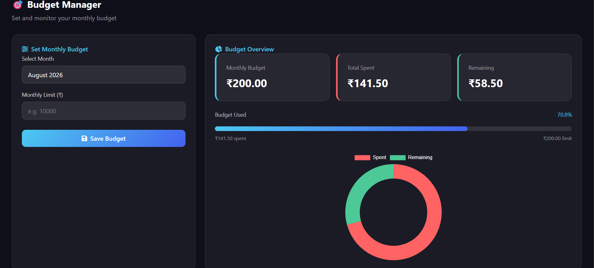

# BudgetFlow 💰

A full-stack expense tracker built for developers — log what you spend on hosting, APIs, domains, courses, and subscriptions, set a monthly budget, and get alerted before you blow past it.

**Live demo:** https://budgetflow-c4f.pages.dev/login
</br>
</br>
**Backend API:** https://budgetflow-1.onrender.com
</br>
</br>
**Demo login:** `demo@budgetflow.com` / `demo1234`

## Tech Stack

- **Frontend:** React.js, React Router, Chart.js (via react-chartjs-2), Bootstrap 5
- **Backend:** FastAPI, Python
- **ORM:** SQLAlchemy
- **Database:** PostgreSQL (Neon)
- **Deployment:** Render (backend), Cloudflare Pages (frontend)

## Features

- User registration and login
- Add, edit, delete, and filter expenses by category (Hosting, APIs, Domains, Courses, Subscriptions, Other)
- Set and update monthly budgets, with automatic upsert per month
- Dashboard with real-time stat cards, category-wise doughnut chart, and spending bar chart
- **Month-over-month comparison** — see how this month's spending compares to last month, as a percentage change
- **Budget limit alerts** — a warning banner appears once you cross 80% of your monthly budget, and turns red if you go over
- **CSV export** — download your full expense history for tax/record-keeping purposes
- Budget overview with a live progress bar (color-shifts past 80% usage) and spent-vs-remaining doughnut chart

## Project Structure

```
budgetflow/
├── app/                  # FastAPI backend
│   ├── main.py           # App entrypoint, routing, CORS setup
│   ├── database.py       # SQLAlchemy engine/session (supports DATABASE_URL or DB_* vars)
│   ├── models.py         # User, Expense, Budget tables
│   ├── schemas.py        # Pydantic request/response schemas
│   ├── seed.py           # Seeds a demo user with sample expenses + budget
│   └── routers/          # users, expenses, budgets, dashboard endpoints
├── frontend/              # React (Vite) frontend
│   ├── public/
│   │   └── _redirects     # SPA fallback routing for Cloudflare Pages
│   └── src/
│       ├── pages/         # Login, Register, Dashboard, Expenses, Budget
│       └── components/    # Shared Navbar
├── requirements.txt
├── runtime.txt            # Pins Python version for deployment
├── .env.example
└── .gitignore
```

## Local Setup

### Backend

```bash
pip install -r requirements.txt
cp .env.example .env   # fill in your PostgreSQL credentials
python -m app.main
```

Runs on `http://localhost:8080`.

Optionally, seed some demo data:
```bash
python -m app.seed
```

### Frontend

```bash
cd frontend
npm install
npm run dev
```

Runs on `http://localhost:5173` in dev mode (talks to the backend on port 8080).

## Deployment

- **Database:** [Neon](https://neon.tech) — free tier, connection string set as `DATABASE_URL`
- **Backend:** [Render](https://render.com) — free web service
  - Build command: `pip install -r requirements.txt`
  - Start command: `uvicorn app.main:app --host 0.0.0.0 --port $PORT`
  - Env vars: `DATABASE_URL` (from Neon), `PYTHON_VERSION=3.11.9`
- **Frontend:** [Cloudflare Pages](https://pages.cloudflare.com) — free tier
  - Root directory: `frontend`
  - Build command: `npm run build`
  - Build output directory: `dist`
  - Env var: `VITE_API_BASE` (your Render backend URL)

Note: both Render's free tier and Neon's free tier spin down/suspend after inactivity — the first request after idle time may take 30-60 seconds to respond.

## 📸 Screenshots

### Login Page


### Register Page


### Dashboard
Real-time spending overview with budget status, category breakdown, and a month-over-month comparison indicator.



### Expense Management
Add, filter, edit, and delete expenses by category, with one-click CSV export for record-keeping.


### Budget Management
Set a monthly budget and track usage with a live progress bar and a spent-vs-remaining breakdown.


## API Overview

| Method | Endpoint | Description |
|---|---|---|
| POST | `/api/users/register` | Register a new user |
| POST | `/api/users/login` | Login with email/password |
| GET | `/api/users/{id}` | Get user by ID |
| POST | `/api/expenses` | Add an expense |
| GET | `/api/expenses/user/{id}` | Get all expenses for a user |
| GET | `/api/expenses/user/{id}/category/{category}` | Filter by category |
| GET | `/api/expenses/user/{id}/date?start=&end=` | Filter by date range |
| PUT | `/api/expenses/{id}` | Update an expense |
| DELETE | `/api/expenses/{id}` | Delete an expense |
| GET | `/api/expenses/user/{id}/total` | Total spending |
| GET | `/api/expenses/user/{id}/export` | Export all expenses as CSV |
| POST | `/api/budgets` | Set or update a monthly budget |
| GET | `/api/budgets/user/{id}/month/{month}` | Get budget for a month |
| GET | `/api/budgets/user/{id}/month/{month}/remaining` | Remaining budget |
| GET | `/api/dashboard/user/{id}/month/{month}` | Aggregated dashboard data, including month-over-month comparison |
